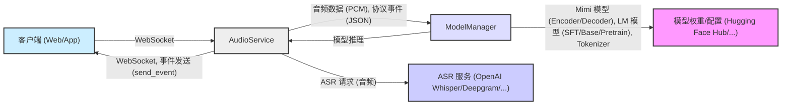
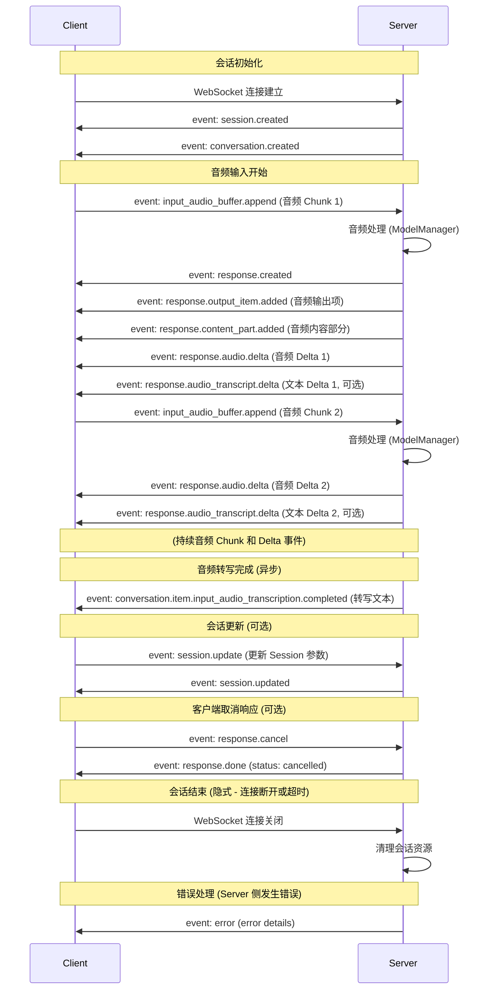

# 实时语音服务构建实践：基于 OpenAI Real-time 协议的技术分享

在这里和大家分享一下构建实时语音服务的实践经验，这个服务是基于 OpenAI 最新推出的 Real-time 协议实现的。 随着 AI 技术的快速发展，实时语音交互的应用前景非常广阔，OpenAI Real-time 协议的出现，为开发者构建高性能的实时语音服务提供了有力的工具。在这篇文章中，我介绍一下这个服务的构建过程，包括技术选型、架构设计、核心组件实现以及性能优化策略。希望这些实践经验能对您有所帮助。

**系统架构设计**

在深入代码之前，先来了解一下系统的整体架构。在设计初期，主要考虑了实时性、可扩展性以及与 OpenAI Real-time 协议的兼容性。 基于这些考虑，最终确定的系统架构如下：




**架构设计思路:**

*   **客户端 (Client):**  客户端应用（Web 或 App）负责捕获用户语音，并将音频数据实时推送至音频服务。同时，客户端需要接收并解析服务发出的 OpenAI Real-time 协议事件，最终将语音和文本响应呈现给用户。
*   **音频服务 (AudioService):**  音频服务是系统的核心，主要职责包括：
    *   **会话管理:**  管理客户端会话的生命周期。
    *   **WebSocket 通信:**  建立和维护与客户端的 WebSocket 连接，接收音频数据和协议事件，并推送事件。
    *   **音频处理管线:**  构建音频处理流程，包括缓存、分帧、预处理等。
    *   **模型推理协调:**  调用模型管理器 (ModelManager) 进行模型推理，并接收推理结果。
    *   **ASR 集成 (可选):**  集成 ASR 服务 (OpenAI Whisper, Deepgram, Gemini) 以支持语音转写功能。
    *   **OpenAI Real-time 协议实现:**  遵循 OpenAI Real-time 协议，封装事件生成和发送逻辑。
*   **模型管理器 (ModelManager):**  模型管理器负责模型资源的加载、管理和推理，其核心职责包括：
    *   **模型加载与缓存:**  加载 Mimi 模型、LM 模型、Tokenizer 等模型组件并进行缓存。
    *   **模型推理接口:**  提供 `process_audio` 接口，简化模型推理调用。
    *   **模型预热 (Warmup):**  实现模型预热机制，降低首次推理延迟。
    *   **并发控制:**  实现并发控制，确保模型在并发访问下的安全性和性能。
*   **ASR 服务 (可选):**  可选集成第三方 ASR 服务，提供语音转写能力。
*   **模型权重/配置:**  模型权重文件和配置信息存储在云端 (Hugging Face Hub) 或本地文件系统。

**核心组件实现：代码实践**

接下来，将分享 `ModelManager` 和 `AudioService` 这两个核心组件的代码实现。

### ModelManager：模型引擎与资源管理

`ModelManager` 类在系统中扮演模型引擎和资源管理的角色。为了高效管理模型资源，采用了**单例模式**来实现 `ModelManager` 类。

**单例模式实现：资源唯一管理**

```python
@dataclass
class ModelManager:
    _instance = None
    _initialized = False

    # ... 模型组件 ...

    def __new__(cls, *args, **kwargs):
        if not cls._instance:
            cls._instance = super().__new__(cls)
        return cls._instance

    @classmethod
    def get_instance(cls, hf_repo: str = loaders.DEFAULT_REPO, device: str = "cuda"):
        if not cls._instance or not cls._initialized:
            instance = cls.from_pretrained(hf_repo, device)
            cls._instance = instance
            cls._initialized = True
            logger.info("Model manager initialized, starting warmup...")
            cls._instance.warmup()
            logger.info("Model warmup completed")
        return cls._instance
```

**模型加载与管理：Hugging Face Hub 集成**

`ModelManager` 的 `from_pretrained` 类方法负责加载模型组件。 使用 `huggingface_hub` 库从 Hugging Face Hub 下载预训练权重。

**关键代码 (模型加载)：**

```python
    @classmethod
    def from_pretrained(cls, hf_repo: str = loaders.DEFAULT_REPO, device: str = "cuda", model_path: str = ""):
        # ... 初始化锁 ...

        # 加载模型组件
        logger.info("loading mimi")
        mimi_weight = hf_hub_download(hf_repo, loaders.MIMI_NAME)
        mimi = loaders.get_mimi(mimi_weight, device)
        logger.info("mimi loaded")

        # Load SFT model
        sft_model_path = os.getenv("SFT_MODEL")
        if not sft_model_path:
            raise ValueError("SFT_MODEL not found")
        logger.info(f"loading sft model {sft_model_path}")
        sft_lm = _get_moshi_lm(sft_model_path, device)
        logger.info("sft model loaded")

        # Load BASE and PRETRAIN models if ENV is set
        # ... (加载 BASE 和 PRETRAIN 模型，如果环境变量设置) ...

        tokenizer_path = hf_hub_download(hf_repo, loaders.TEXT_TOKENIZER_NAME)
        text_tokenizer = sentencepiece.SentencePieceProcessor(tokenizer_path)
        sft_lm_gen = LMGen(sft_lm)

        # 设置持续推理模式
        mimi.streaming_forever(1)
        sft_lm_gen.streaming_forever(1)
        # ... (其他初始化) ...
```

**`process_audio` 方法：核心推理流程**

`process_audio` 方法是 `ModelManager` 的核心，负责接收音频 chunk，执行模型推理，并返回文本和音频数据。

**关键代码逻辑 (process_audio):**

1.  **音频编码:**  使用 `mimi.encode(chunk)` 编码音频 chunk。
2.  **选择 LM 模型:**  根据 `model_type` 选择 LM 模型生成器。
3.  **循环推理 (Streaming):**  循环遍历 codes，调用 LM 模型的 `step` 方法进行流式推理。
4.  **音频解码 (如果生成 tokens):**  使用 `mimi.decode(tokens[:, 1:])` 解码 tokens 为音频 PCM 数据。
5.  **文本 token 转换 (如果生成 tokens):**  使用 `text_tokenizer.id_to_piece` 将 token ID 转换为文本片段。
6.  **返回结果:**  返回文本消息和音频 PCM 数据。

**代码片段 (process_audio 核心逻辑):**

```python
    @torch.inference_mode()
    def process_audio(self, chunk: torch.Tensor, model_type :str = "sft") -> tuple[Optional[str], Optional[np.ndarray]]:
        """处理音频并生成响应"""
        codes = self.mimi.encode(chunk)
        text_msg = None
        audio_pcm = None

        for c in range(codes.shape[-1]):
            tokens = self._get_lm_gen(model_type).step(codes[:, :, c : c + 1]) # 模型推理
            if tokens is None:
                continue

            pcm = self.mimi.decode(tokens[:, 1:]) # 音频解码
            audio_pcm = pcm.cpu()[0, 0].numpy()

            text_token = tokens[0, 0, 0].item()
            if text_token not in (0, 3):
                text = self.text_tokenizer.id_to_piece(text_token) # token -> 文本
                text = text.replace(" ", " ")
                text_msg = text

        return text_msg, audio_pcm
```

**并发控制与模型预热：性能提升**

*   **`asyncio.Lock`**:  使用 `asyncio.Lock` 保证并发场景下模型访问安全。
*   **`warmup` 方法**:  `warmup` 方法在初始化后调用，预热模型，降低推理延迟。

### AudioService：协议实现与会话管理中心

`AudioService` 负责处理客户端 WebSocket 连接、会话管理、音频处理流程以及 OpenAI Real-time 协议交互。

**会话管理与状态维护：`SessionState` 数据类**

使用 `self.sessions` 字典管理会话状态 (`SessionState`)。 `create_session` 方法创建新会话并初始化 `SessionState` 对象。

**`SessionState` 数据类定义：**

```python
@dataclass
class SessionState:
    session: Resource.Session
    conversation: Optional[Resource.Conversation] = None
    current_response: Optional[Resource.Response] = None
    audio_state: Optional[AudioState] = None

    first_sent: bool = False  # 是否已经发送过第一个音频响应
    item_id: Optional[str] = None  # 当前音频响应的item_id

    # ... 索引计数器 ...

    def reset_audio(self, sample_rate: int):
        # ... 重置音频状态和索引 ...
```

**WebSocket 事件处理 (`handle_client` 方法)：事件驱动架构**

`handle_client` 方法处理客户端 WebSocket 连接，监听并处理不同类型的事件。

**关键代码逻辑 (handle_client):**

1.  **创建会话:**  调用 `self.create_session()` 创建会话状态。
2.  **发送初始化事件:**  发送 `session.created` 和 `conversation.created` 事件。
3.  **启动音频流处理任务 (`handle_audio_stream`):**  创建异步任务处理音频流。
4.  **事件接收循环:**  循环监听客户端 WebSocket 消息。
5.  **事件解析:**  解析 JSON 消息，获取事件类型和数据。
6.  **事件分发处理:**  根据 `event["type"]` 执行不同逻辑 (session.update, input_audio_buffer.append, response.cancel 等)。
7.  **错误处理和资源清理:**  使用 `try...except...finally` 结构进行错误处理和资源清理。

**音频流处理 (`handle_audio_stream` 方法)：实时响应引擎**

`handle_audio_stream` 方法负责音频数据读取、分帧、模型推理以及实时响应发送。 包含 `audio_process_loop` 和 `transcription_loop` 两个异步循环。

**关键代码逻辑 (`audio_process_loop`):**

1.  **循环读取 PCM 数据:**  从 `audio_state.pcm_buffer.read_pcm()` 读取 PCM 数据。
2.  **音频数据累积与分帧:**  累积 PCM 数据到 `audio_state.all_pcm_data`，并分帧处理。
3.  **模型推理:**  将音频 chunk 转换为 Tensor，调用 `self.process_audio_and_generate` 进行推理。
4.  **音频/文本响应实时发送:**  使用 `send_event` 发送 `response.audio.delta` 和 `response.audio_transcript.delta` 事件。
5.  **Real-time 协议事件封装:**  在首次发送音频响应前，发送 `response.output_item.added` 和 `response.content_part.added` 事件。

**关键代码逻辑 (`transcription_loop`):**

`transcription_loop` 异步处理音频转写任务，定期检查 `audio_state.transcription_buffer` 中的音频数据，发送给 ASR 服务转写，并通过 `conversation.item.input_audio_transcription.completed` 事件发送结果。

**Client-Server Event 时序图：协议交互流程**



**性能优化：实践经验**

性能优化策略包括：

*   **GPU 加速：**  模型推理 GPU 加速。
*   **异步编程 (asyncio)：**  `AudioService` 基于 `asyncio` 构建，实现高并发和低延迟。
*   **流式推理 (Streaming Inference)：**  利用 Mimi 模型和 LM 模型的流式推理特性。
*   **音频分帧处理：**  音频流分割成固定大小的帧 (chunk, `frame_size`) 处理。
*   **模型预热 (Warmup)：**  服务启动时进行模型预热。
*   **模型单例模式：**  `ModelManager` 单例模式避免重复加载模型。
*   **高效数据结构：**  使用 `PCM16Buffer` 和 `TranscriptionBuffer` 等高效数据结构。

**未来展望：服务进化**

未来的改进方向包括：

*   **更强大的 ASR 服务集成：**  提升语音转写准确率和鲁棒性。
*   **多轮对话能力：**  支持对话上下文管理，实现多轮对话。
*   **模型多样性与灵活配置：**  支持更多模型选择和配置选项。
*   **Tool/Function Calling 功能：**  集成 Tool/Function Calling 功能。
*   **服务部署与弹性伸缩：**  研究服务部署方案和弹性伸缩能力。
*   **安全性加固：**  加强服务安全性设计。

**总结：构建心得**

构建基于 OpenAI Real-time 协议的实时语音服务是一次有益的实践。 通过这篇文章，希望能够分享一些实践经验，帮助开发者了解 OpenAI Real-time 协议，并构建出更优秀的实时语音交互应用。 感谢阅读！

